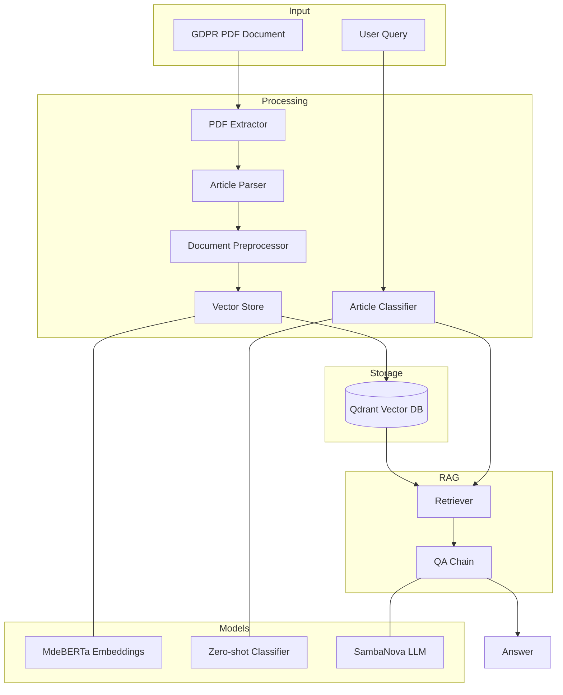
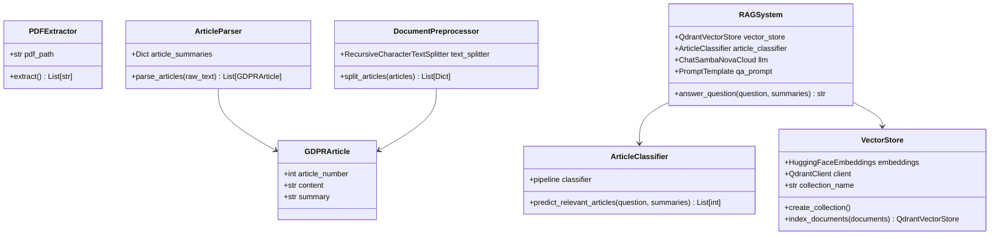
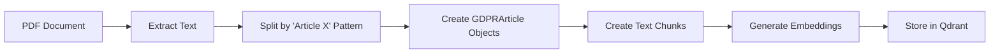
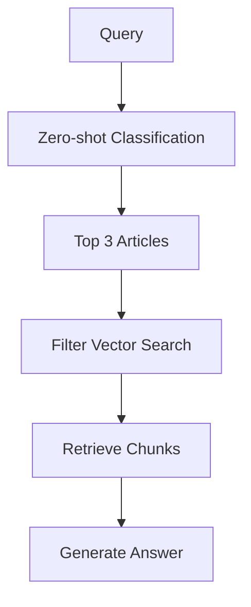

# GDPR Articles RAG System

A Retrieval-Augmented Generation (RAG) system for querying and retrieving information from GDPR Articles. The system uses LangChain, Qdrant vector store, and SambaNova's Llama 3.1 8B model for accurate and context-aware responses to GDPR-related questions.

## System Architecture




## Class Design



## Key Features

1. **Article Segregation**
   - Uses regex pattern matching (`Article X`) to accurately split GDPR text into individual articles
   - Maintains article integrity by tracking start and end markers
   - Preserves article metadata including number and summary

2. **Vector Search**
   - MdeBERTa embeddings for semantic understanding
   - Qdrant vector store with persistent storage
   - Filtered retrieval based on article classification

3. **Zero-shot Article Classification**
   - Predicts relevant articles using article summaries
   - Multi-label classification for comprehensive coverage
   - Top-3 article selection for focused retrieval

## Setup Instructions

1. **Environment Setup**
```bash
!pip install langchain langchain_community qdrant-client pypdf transformers sentence-transformers langchain_qdrant
```

2. **Mount Google Drive** (for Colab)
```python
from google.colab import drive
drive.mount('/content/drive')
```

3. **Configure Environment Variables**
```python
os.environ["SAMBANOVA_API_KEY"] = "your-api-key"
```

4. **Prepare Data**
- Upload GDPR PDF to `/content/drive/MyDrive/GDPR Art 1-21.pdf`
- Create Qdrant storage directory: `/content/drive/MyDrive/qdrant_storage`

## Usage Examples

### Training Mode
Initialize the system and process the PDF:
```python
main(mode=None)
```

### Inference Mode
Query the pre-processed vector store:
```python
main(mode="inference")
```

### Example Queries and Responses

1. **Query**: "What are the main principles for processing personal data?"
```
Article selection result:
Top articles: [6, 5, 18]
Scores: [0.963, 0.954, 0.912]

Answer: The main principles for processing personal data are:
1. Lawfulness, Fairness, and Transparency
2. Purpose Limitation
3. Data Minimization
4. Accuracy
5. Storage Limitation
6. Integrity and Confidentiality
[...]
```

2. **Query**: "How can I exercise my right to be forgotten?"
```
Article selection result:
Top articles: [18, 17, 11]
Scores: [0.959, 0.950, 0.945]

Answer: To exercise your right to be forgotten:
1. Identify the personal data
2. Check if the data is being processed
3. Verify the data's source
[...]
```

## Implementation Details

### Article Processing Flow


### Query Processing Flow

